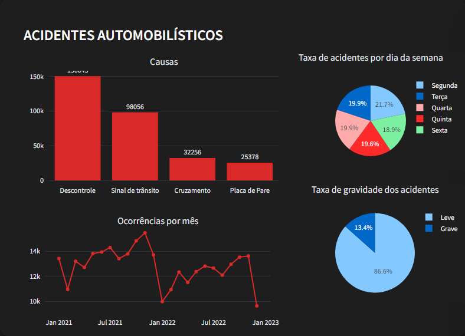
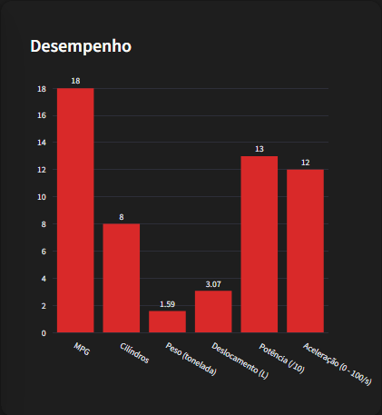
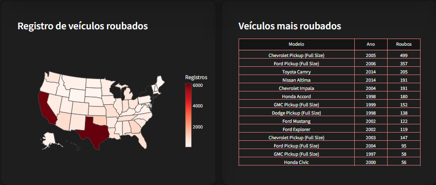
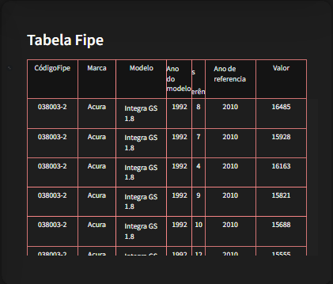

<h1 align="center">🚗 INFO CARS</h1>

## Descrição

Este projeto é um dashboard interativo criado utilizando a biblioteca Streamlit em Python, que fornece uma análise abrangente sobre diversas informações relacionados a carros. As principais áreas de foco do dashboard incluem:

### 1. Registro de Acidentes Automobilísticos:

Estatísticas e visualizações sobre acidentes de carros, incluindo frequência, causas comuns, e tendências ao longo do tempo.
<p align="center">

</p>

### 2. Desempenho dos Carros:

Avaliação do desempenho dos carros com base em vários critérios como eficiência de combustível, velocidade, aceleração, e durabilidade.
<p align="center">

</p>

### 3. Carros Roubados:

Análise de incidentes de carros roubados, identificando padrões, locais de maior incidência, e características dos veículos mais visados.
<p align="center">

</p>

### 4. Consulta de Informações sobre carros

Oferece uma consulta detalhada dos preços de veículos segundo a Tabela FIPE. Inclui informações sobre os preços médios de carros, motos e caminhões, permitindo a comparação de preços entre diferentes modelos e anos de fabricação.
<p align="center">

</p>

## Ferramentas

### Linguagem
-[Python](https://docs.python.org/3/)

### Framework de Aplicação Web
-[Streamlit](https://discuss.streamlit.io/)

### Bibliotecas
-[Plotly express](https://plotly.com/python/)

### Manipulação de Dados
-[Pandas](https://pandas.pydata.org/docs/)

### Estilização
-[CSS](https://developer.mozilla.org/en-US/docs/Web/CSS)

## Instruções para Executar o Projeto

### Pré-requisitos

Certifique-se de ter os seguintes itens instalados no seu sistema:

- **Python 3.6 ou superior**
- **pip** (gerenciador de pacotes do Python)

### Passo 1: Fazer o Download do Repositório

Baixe o repositório deste projeto em sua máquina local. Para fazer o download você terá que clicar no botão "Code" e depois em "Download ZIP" na página do GitHub. Em seguida, extrair o conteúdo do arquivo ZIP.

### Passo 2: Navegar até o Diretório do Projeto

Acesse o diretório do projeto que você acabou de extrair:

```bash
cd caminho/para/o/diretorio
```

### Passo 3: Descompactar arquivos

Para a execução do código será necessário descompactar o arquivo "data.rar", localizado dentro da pasta "/data" (Por motivos de limite de armazenamento)


### Passo 4: Instalar os Requisitos

Instale as dependências do projeto:

```bash
$ pip install pandas plotly streamlit 
```

### Passo 5: Executar o Projeto

Execute este comando no seu terminal, para iniciar a aplicação em Streamlit:

```bash
streamlit run app.py
```


### Passo 6: Acessar o Dashboard

Abra seu navegador e para visualizar o dashboard vá para:

```bash
http://localhost:8501
```

### Contato

- **Email**: [pedrohenriquesilva08102005@gmail.com](pedrohenriquesilva08102005@gmail.com)
- **LinkedIn**: [Pedro Henrique](https://www.linkedin.com/in/pedro-henrique-2642a2248/)
- **GitHub**: [Pedro-Henrique-Fersilv](https://github.com/Pedro-Henrique-Fersilv)